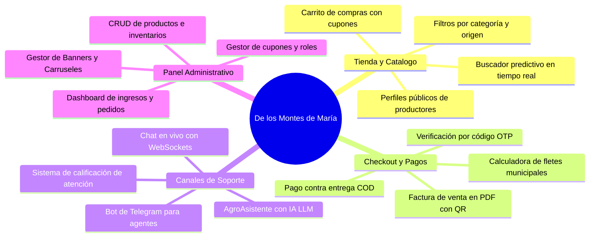
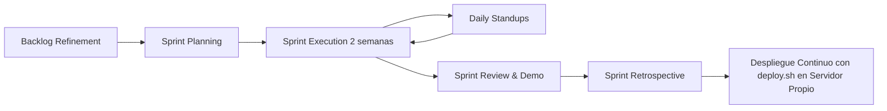
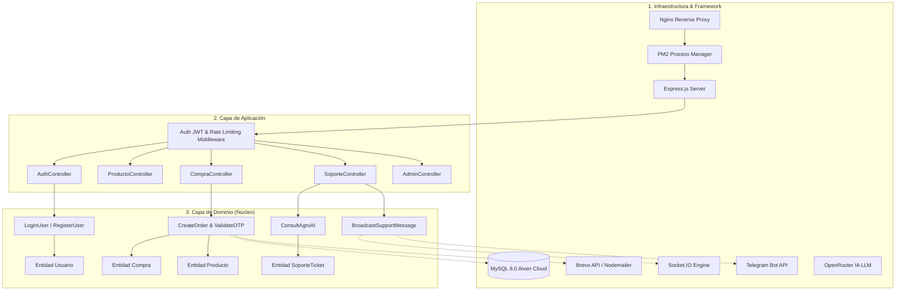
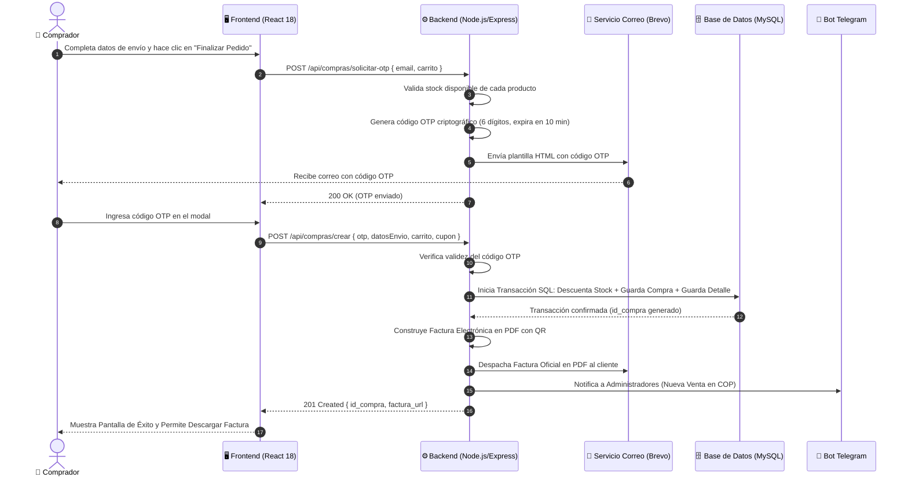
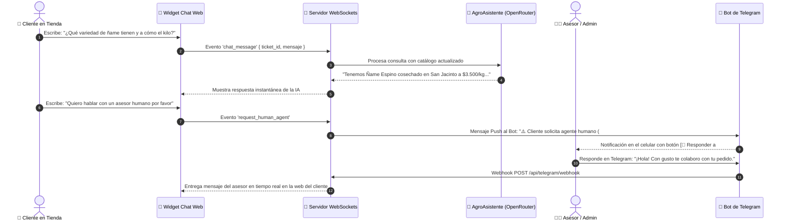
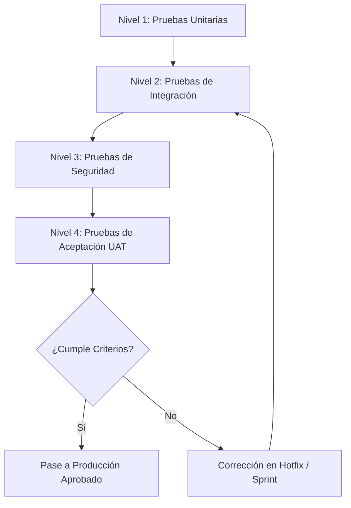
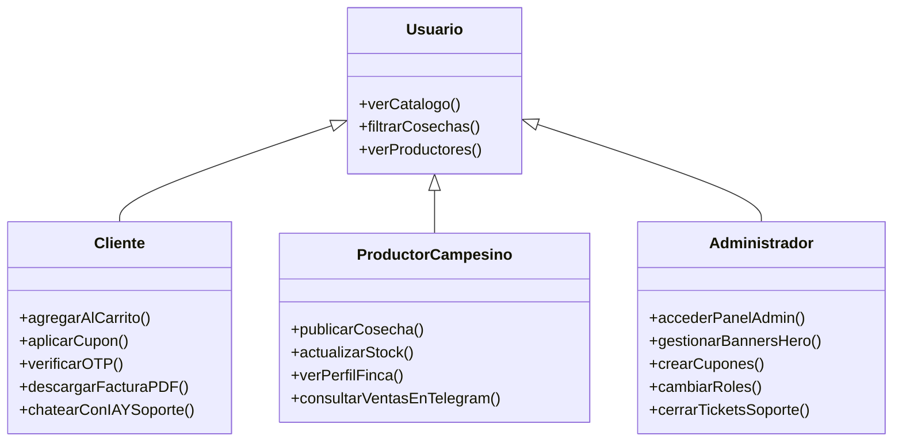

# 🌾 DOCUMENTO DE ESPECIFICACIÓN Y GESTIÓN DE PROYECTO
## PLATAFORMA AGROPECUARIA & COMERCIO CAMPESINO DIRECTO: DE LOS MONTES DE MARÍA

---

# 1. INFORMACIÓN GENERAL Y ALCANCE

## 1.1 Portada y Control de Versiones

| Parámetro | Detalle |
| :--- | :--- |
| **Nombre del Proyecto** | De los Montes de María — Plataforma Agropecuaria & Comercio Campesino Directo |
| **Código del Proyecto** | AGRO-MDM-2026 |
| **Autor / Líder Técnico** | Danilo Rodelo & Equipo de Desarrollo De los Montes de María |
| **Organización** | De los Montes de María S.A.S. |
| **Fecha de Creación** | 15 de Febrero de 2026 |
| **Última Actualización** | 19 de Agosto de 2026 |
| **Versión del Documento** | 2.5.0 |
| **Estado del Proyecto** | Producción / Operación en Servidor Propio |
| **Repositorio Oficial** | [GitHub - Danx016/delosmontesdemaria](https://github.com/Danx016/delosmontesdemaria) |
| **URL Producción** | [delosmontesdemaria.duckdns.org](http://delosmontesdemaria.duckdns.org) |

### Registro de Cambios (Changelog)

| Versión | Fecha | Autor | Descripción de Cambios |
| :--- | :--- | :--- | :--- |
| **1.0.0** | 15/02/2026 | D. Rodelo | Creación de la arquitectura base monolítica inicial con Express y vistas EJS. |
| **1.5.0** | 22/03/2026 | D. Rodelo | Migración a SPA con React 18 + Vite, desacoplamiento de API REST y Context API. |
| **2.0.0** | 10/05/2026 | D. Rodelo | Refactorización a Clean Architecture (DDD), integración de MySQL en Aiven Cloud. |
| **2.2.0** | 18/06/2026 | D. Rodelo | Integración de WebSockets (Socket.IO) para soporte en vivo y pasarela de correo Brevo/SMTP. |
| **2.4.0** | 25/07/2026 | D. Rodelo | Implementación del bot oficial de Telegram (`@montesdemariabot`) y AgroAsistente con IA (OpenRouter). |
| **2.5.0** | 19/08/2026 | D. Rodelo | Migración a Servidor Propio (Ubuntu Linux + Nginx Reverse Proxy + PM2) y automatización con `deploy.sh`. |

---

## 1.2 Resumen Ejecutivo

### El Problema
La subregión de los **Montes de María** (comprendida entre los departamentos de Bolívar y Sucre en el Caribe colombiano) es una de las despensas agrícolas más ricas y resilientes del país. No obstante, los pequeños y medianos productores campesinos enfrentan barreras estructurales críticas:
1. **Intermediación Abusiva:** Los intermediarios tradicionales capturan entre el 50% y 70% del valor final de la cosecha, dejando al campesino márgenes mínimos de rentabilidad.
2. **Pérdida Poscosecha:** Dificultad para encontrar compradores directos antes del deterioro de productos perecederos (ñame, yuca, plátano, aguacate, lácteos).
3. **Brecha Digital y de Canales:** Falta de herramientas tecnológicas accesibles y adaptadas a las realidades de conectividad rural para exhibir productos, gestionar inventarios y recibir pedidos confiables.

### La Solución Propuesta
**De los Montes de María** es un ecosistema digital integral de comercio justo agropecuario que conecta directamente a los campesinos y artesanos con consumidores particulares, restaurantes y mayoristas en todo el territorio colombiano. 

La plataforma combina:
* Una aplicación web moderna (SPA en React 18) responsive y ligera.
* Un backend escalable en Node.js estructurado bajo Clean Architecture.
* Un sistema de verificación de transacciones mediante códigos de un solo uso (OTP) por correo.
* Facturación electrónica automática con código QR.
* Soporte híbrido inteligente en tiempo real combinando WebSockets, Asistente con Inteligencia Artificial (LLM) y un **Bot oficial de Telegram** que permite a administradores y productores gestionar ventas y soporte sin necesidad de estar frente a una computadora.

### Impacto Esperado
* **Económico:** Aumento del 35% al 60% en los ingresos netos percibidos por los campesinos al vender a precios justos directos.
* **Social:** Visibilización y dignificación del campesinado de municipios como El Carmen de Bolívar, San Jacinto, San Juan Nepomuceno, Ovejas, Chalán y María La Baja.
* **Operativo:** Tiempos de respuesta de soporte inferiores a 3 minutos y formalización de transacciones mediante facturación digital estándar.

---

## 1.3 Objetivos del Proyecto

```
                   ┌────────────────────────────────────────────────────────┐
                   │                   OBJETIVO GENERAL                     │
                   │  Conectar campesinos con compradores sin intermediación│
                   └───────────────────────────┬────────────────────────────┘
                                               │
        ┌──────────────────────────────┬───────┴──────────────────────┬──────────────────────────────┐
        ▼                              ▼                              ▼                              ▼
 ┌──────────────┐               ┌──────────────┐               ┌──────────────┐               ┌──────────────┐
 │  ESPECÍFICO 1│               │  ESPECÍFICO 2│               │  ESPECÍFICO 3│               │  ESPECÍFICO 4│
 │  E-Commerce  │               │ Transaccional│               │ Soporte & IA │               │  Operaciones │
 │  Campesino   │               │  OTP + Fact  │               │ + Telegram   │               │ Admin & KPI  │
 └──────────────┘               └──────────────┘               └──────────────┘               └──────────────┘
```

### Objetivo General
Desarrollar, desplegar y operar una plataforma tecnológica integral de comercio electrónico y gestión agropecuaria que suprima intermediarios comerciales, digitalice el catálogo de cosechas de los Montes de María y asegure transacciones transparentes y verificables entre el campo y la ciudad.

### Objetivos Específicos (Criterios SMART)

| ID | Objetivo Específico | Indicador / Criterio SMART |
| :--- | :--- | :--- |
| **OE-01** | **Digitalización del Catálogo Campesino:** Desarrollar un sistema de catálogo dinámico que permita registrar al menos 50 productos agrícolas diferenciados por origen municipal y campesino productor, con filtros de búsqueda en menos de 200 ms. | *Específico, Medible, Temporal (Trimestre 1).* |
| **OE-02** | **Seguridad en Checkout y Formalización:** Implementar un flujo de pago contra entrega con validación de seguridad OTP vía email y generación automática de factura electrónica en PDF con QR en menos de 2 segundos por orden. | *Medible (100% de órdenes con OTP y Factura), Alcanzable.* |
| **OE-03** | **Atención Multicanal en Tiempo Real:** Integrar un sistema de soporte al cliente con WebSockets, AgroAsistente IA (OpenRouter) y Bot de Telegram bidireccional, logrando resolver el 70% de dudas frecuentes automáticamente y escalando a humanos con 1 clic. | *Específico, Medible (>70% automatización, <3 min respuesta humana).* |
| **OE-04** | **Gestión Administrativa Centralizada:** Diseñar un panel de control con métricas en tiempo real de ventas, control de inventario, gestión de banners promocionales y cupones de descuento. | *Relevante, Medible (Disponibilidad 99.5% de panel).* |

---

## 1.4 Alcance del Proyecto

### Qué Incluye (Entregables y Funcionalidades Clave)



1. **Módulo de Comercio Electrónico (Frontend SPA):**
   * Catálogo con categorización: *Cosechas Frescas, Lácteos Artesanales, Semillas Nativas, Abonos y Fertilizantes, Herramientas*.
   * Perfil público de cada campesino con historia de la finca, productos y calificaciones.
   * Carrito de compras reactivo con persistencia local y soporte para cupones promocionales.
   * Modos visuales Claro / Oscuro y diseño adaptativo a dispositivos móviles.

2. **Módulo Transaccional y Checkout:**
   * Modal de checkout con selección dinámica de departamentos y municipios de Colombia.
   * Generación y validación de token OTP de 6 dígitos enviado por correo electrónico.
   * Facturación electrónica en PDF con código QR, desglose de impuestos/descuentos y datos legales.

3. **Módulo de Soporte y Chat en Vivo Multicanal:**
   * Chat Web en tiempo real cliente-asesor mediante Socket.IO.
   * Asistente virtual con Inteligencia Artificial (OpenRouter API) con conocimiento del catálogo.
   * Integración con Telegram Bot (`@montesdemariabot`) con soporte para respuestas directas vía Webhook.

4. **Panel Administrativo (`/admin`):**
   * Tablero con métricas de ventas en COP, conteo de pedidos y alertas de stock bajo.
   * Editor visual de carrusel hero de la página principal (imágenes, tinte de color, desenfoque y CTA).
   * Administración de usuarios, roles (Admin, Vendedor, Cliente, Soporte) y direcciones.

### Qué NO Incluye (Límites y Fuera de Alcance)

| Elemento Excluido | Justificación Técnica / Operativa | Alternativa o Fase Futura |
| :--- | :--- | :--- |
| **Flota Logística Propia** | El proyecto no contempla la adquisición ni operación directa de vehículos de transporte de carga. | Se utiliza integración con empresas transportadoras y modelo contra entrega con flete calculado. |
| **Microcréditos Financieros** | No se implementa intermediación bancaria ni captación de ahorros regulados por la Superfinanciera. | Se proporciona enlace y contacto comercial con cooperativas agrícolas locales. |
| **App Nativa en Play Store / App Store** | No se desarrollaron binarios nativos (Java/Swift) en esta versión para agilizar costos y despliegues. | La plataforma es una aplicación web 100% responsiva optimizada para cualquier navegador móvil y de escritorio. |
| **Hardware de Telemetría IoT en Fincas** | No se incluyen sensores de humedad, suelo ni estaciones meteorológicas de hardware. | Se prevé como módulo de extensión para la fase v3.0 mediante API REST abierta. |

---

# 2. REQUERIMIENTOS Y DISEÑO

## 2.1 Requerimientos Funcionales (RF)

```
[RF-01: Autenticación & Usuarios] ───► [RF-02: Gestión de Catálogo] ───► [RF-03: Carrito & Cupones]
                                                                                  │
[RF-06: Panel Administrativo]      ◄─── [RF-05: Soporte & Telegram] ◄─── [RF-04: Checkout & Facturación]
```

| ID | Nombre del Requerimiento | Descripción Detallada | Criterio de Éxito |
| :--- | :--- | :--- | :--- |
| **RF-01** | **Autenticación y Perfiles** | El sistema debe permitir registro e inicio de sesión mediante credenciales locales (correo/contraseña con hash Bcrypt) y Google OAuth 2.0. Debe permitir recuperación de contraseña mediante código OTP. | Login en < 1s, almacenamiento seguro de token JWT en cookie HttpOnly. |
| **RF-02** | **Gestión de Catálogo e Inventario** | Los vendedores y administradores deben poder crear, editar, pausar y eliminar productos con fotografías, descripción, precio unitario, stock disponible, origen y presentación. | Actualización en tiempo real del stock tras confirmación de compra. |
| **RF-04** | **Checkout con OTP y Facturación PDF** | Antes de asentar la orden contra entrega, el sistema debe remitir un código OTP al correo del comprador. Al ser validado, se genera la orden, se descuenta inventario y se envía factura en PDF con QR. | Factura generada y enviada al correo del comprador en < 3s. |
| **RF-05** | **Soporte Híbrido (IA + Socket.IO + Telegram)** | El usuario debe contar con un widget de chat en vivo atendido inicialmente por IA. Si solicita asesor humano, se notifica al canal de Telegram de administradores, permitiendo responder desde Telegram o la web. | Transmisión bidireccional de mensajes en menos de 500 ms. |
| **RF-06** | **Panel Administrativo y Banners** | El administrador debe poder visualizar métricas de ingresos, gestionar productos, administrar cupones, cambiar roles de usuarios y configurar los banners del carrusel de inicio. | Cambios en carrusel y cupones reflejados de inmediato en la tienda. |

---

## 2.2 Requerimientos No Funcionales (RNF)

| Categoría | ID | Requerimiento No Funcional | Métrica / Estándar de Cumplimiento |
| :--- | :--- | :--- | :--- |
| **Rendimiento** | **RNF-01** | **Tiempo de Respuesta de API:** Los endpoints de lectura REST deben responder en menos de 300 ms en condiciones de carga estándar (hasta 250 req/s). | Pruebas de estrés y benchmarking con Apache Benchmark / Autocannon. |
| **Seguridad** | **RNF-02** | **Cifrado y Protección Web:** Uso obligatorio de HTTPS, cabeceras seguras mediante Helmet, protección CSRF, Rate Limiting (máx. 100 req/15 min por IP en rutas públicas, 10 req/min en OTP), y Bcrypt a 12 salt rounds. | Calificación A+ en escaneos de cabeceras HTTP y SSL Labs. |
| **Disponibilidad** | **RNF-03** | **Uptime del Sistema:** La plataforma en producción en servidor Linux propio (Nginx + PM2 + Aiven Cloud) debe garantizar una disponibilidad mensual mínima del 99.5%. | Monitoreo continuo mediante PM2 status, healthchecks y UptimeRobot. |
| **Usabilidad** | **RNF-04** | **Accesibilidad y Adaptabilidad:** Interfaz 100% responsiva (Mobile First), soporte de temas claro/oscuro y contrastes visuales conformes con WCAG 2.1 Nivel AA. | Score de Lighthouse en Accesibilidad y Best Practices > 90/100. |
| **Legal / Normativa** | **RNF-05** | **Habeas Data (Ley 1581 de 2012):** Cumplimiento de la legislación colombiana de protección de datos personales. Derecho de acceso, rectificación y eliminación de cuenta. | Cláusula de consentimiento explícito en checkout y registro. |

---

## 2.3 Metodología de Trabajo

El desarrollo se gestionó bajo el marco ágil **Scrum / Agile Híbrido** adaptado a entregas continuas (CI/CD):



* **Duración de Sprints:** Ciclos de 2 semanas (10 días hábiles).
* **Ceremonias:**
  * *Sprint Planning:* Definición de historias de usuario y priorización en Kanban.
  * *Daily Standups:* Sincronización de 15 minutos enfocada en bloqueos técnicos.
  * *Sprint Review & Retrospective:* Demostración funcional en entorno staging y lecciones aprendidas.
* **Herramientas:** GitHub Projects / Issues para seguimiento de tareas, Git Flow para ramas (`main`, `develop`, `feature/*`, `hotfix/*`).

---

## 2.4 Arquitectura del Software & Diseño del Proceso

### Arquitectura Limpia (Clean Architecture) & DDD

El backend desacopla totalmente las reglas de negocio de los detalles de infraestructura:



### Mapeo de Procesos de Negocio

#### 1. Proceso de Checkout con Pago Contra Entrega y Validación OTP



#### 2. Proceso de Soporte Multicanal (IA -> Humano -> Telegram)



---

## 2.5 Stack Tecnológico Detallado

| Capa | Tecnología | Versión | Propósito / Justificación Técnica |
| :--- | :--- | :--- | :--- |
| **Frontend Framework** | React | `18.3.1` | Renderizado reactivo por componentes, Virtual DOM de alto desempeño. |
| **Tooling & Bundler** | Vite | `5.4.x` | Compilación ultra rápida mediante ES Modules y Hot Module Replacement (HMR). |
| **Estilos & Diseño** | Vanilla CSS + Tokens | CSS3 Moderno | Cero sobrecarga de librerías pesadas; variables HSL para modo oscuro nativo. |
| **Enrutamiento** | React Router DOM | `6.26.x` | Navegación del lado del cliente fluida sin recargas de página. |
| **Servidor / SO** | Ubuntu Linux (VPS Propio) | `22.04 LTS` | Entorno de servidor dedicado bajo control total y alto desempeño. |
| **Reverse Proxy** | Nginx | `1.18+` | Balanceo, compresión gzip, terminación SSL y proxy para WebSockets. |
| **Gestor de Procesos** | PM2 | `5.x` | Monitoreo de procesos en segundo plano, reinicio automático y cluster. |
| **Backend Runtime** | Node.js | `>= 18.0.0` | Arquitectura asíncrona no bloqueante basada en eventos. |
| **Framework HTTP** | Express.js | `5.1.0` | Enrutamiento modular, soporte robusto de middlewares y APIs RESTful. |
| **Base de Datos** | MySQL Server | `8.0 (Aiven)` | Integridad relacional estricta, soporte transaccional ACID y Pool de conexiones SSL. |
| **WebSockets** | Socket.IO | `4.8.3` | Comunicación bidireccional en tiempo real para mensajería de soporte. |
| **Seguridad** | Bcrypt / JWT / Helmet | `6.0 / 9.0 / 8.1` | Hash de contraseñas de alta seguridad, tokens de sesión y endurecimiento de cabeceras HTTP. |
| **Emails Transaccionales** | Brevo REST API / Nodemailer | `v3 / 8.0.7` | Envío confiable de códigos OTP y facturas electrónicas en PDF sin bloqueo por puertos. |
| **Inteligencia Artificial** | OpenRouter API | REST | Modelos de lenguaje adaptados para contexto agronómico local. |
| **Mensajería Instantánea** | Telegram Bot API | Webhook HTTPS | Operación móvil 1-click para el equipo de ventas y soporte (`@montesdemariabot`). |

---

# 3. PLANIFICACIÓN, RECURSOS Y RIESGOS

## 3.1 Cronograma e Hitos Principales (WBS / EDT)

```
Fase 1: Análisis y Arquitectura ────► [01/Feb - 20/Feb]
Fase 2: Backend Core & DB       ────► [21/Feb - 20/Mar]
Fase 3: Frontend SPA & React    ────► [21/Mar - 25/Abr]
Fase 4: Integraciones & Bots    ────► [26/Abr - 20/May]
Fase 5: Pruebas, QA & Hardening ────► [21/May - 15/Jun]
Fase 6: Despliegue en Servidor  ────► [16/Jun - Operación Continua]
```

### Tabla de Desglose de Trabajo (WBS)

| Fase | Hito / Entregable Principal | Fecha Inicio | Fecha Fin | Estado |
| :--- | :--- | :--- | :--- | :--- |
| **Fase 1** | Definición de Requerimientos, Wireframes y Modelo Entidad-Relación | 01/02/2026 | 20/02/2026 | **Completado** |
| **Fase 2** | Backend API REST, Clean Architecture y Base de Datos MySQL Aiven | 21/02/2026 | 20/03/2026 | **Completado** |
| **Fase 3** | Frontend React 18, Catálogo, Filtros, Carrito y Panel Admin | 21/03/2026 | 25/04/2026 | **Completado** |
| **Fase 4** | Checkout OTP, Facturación PDF, AgroAsistente IA y Bot Telegram | 26/04/2026 | 20/05/2026 | **Completado** |
| **Fase 5** | Pruebas de Carga, Seguridad, Pruebas de Aceptación con Campesinos | 21/05/2026 | 15/06/2026 | **Completado** |
| **Fase 6** | Puesta en Marcha en Servidor Propio (Ubuntu + Nginx + PM2) | 16/06/2026 | Vigente | **En Operación** |

---

## 3.2 Roles y Responsabilidades (Matriz RACI)

* **R (Responsible):** Quien ejecuta la tarea.
* **A (Accountable):** Quien aprueba y responde por el resultado final.
* **C (Consulted):** Quien aporta información técnica o de negocio.
* **I (Informed):** Quien es notificado del avance.

| Actividad / Entregable | Líder de Proyecto | Dev Backend | Dev Frontend | Diseñador UI/UX | Asesor Agrícola / Campesino |
| :--- | :---: | :---: | :---: | :---: | :---: |
| **Diseño de Base de Datos y Clean Architecture** | **A** | **R** | **C** | **I** | **I** |
| **Diseño de Interfaz de Usuario y Responsive** | **A** | **I** | **R** | **R** | **C** |
| **Implementación de API REST y Checkout OTP** | **A** | **R** | **C** | **I** | **I** |
| **Desarrollo de SPA React y Context API** | **A** | **C** | **R** | **C** | **I** |
| **Integración Telegram Bot & AgroAsistente IA** | **A** | **R** | **C** | **I** | **C** |
| **Validación de Catálogo y Precios de Cosechas** | **A** | **I** | **I** | **I** | **R** |
| **Administración Servidor Linux, Nginx y PM2** | **A** | **R** | **C** | **I** | **I** |

---

## 3.3 Presupuesto y Recursos

### Recursos de Infraestructura y Servicios Cloud (Cálculo Anual Estimado)

| Recurso / Servicio | Proveedor | Nivel / Plan | Costo Mensual (USD) | Costo Anual (USD) |
| :--- | :--- | :--- | :--- | :--- |
| **Servidor Dedicado / VPS Propio (Ubuntu)** | Servidor Propio / VPS | Linux Ubuntu 22.04 LTS (PM2 + Nginx) | $5.00 | $60.00 |
| **Base de Datos MySQL Gestionada** | Aiven Cloud | Startup / Cloud Free Tier | $0.00 | $0.00 |
| **Servicio de Correo Transaccional** | Brevo / Google Workspace | Free Tier (300 emails/día) | $0.00 | $0.00 |
| **Modelos de Inteligencia Artificial** | OpenRouter | Pay-as-you-go / Free tier | $3.00 | $36.00 |
| **DNS Dinámico / Dominio** | DuckDNS / Cloudflare | Dynamic DNS + Certbot Let's Encrypt | $0.00 | $0.00 |
| **Bot de Telegram** | Telegram Bot API | Nivel Oficial / Gratuito | $0.00 | $0.00 |
| **TOTAL INFRAESTRUCTURA** | | | **$8.00 / mes** | **$96.00 / año** |

---

## 3.4 Matriz de Riesgos y Mitigación

```
   Alto  ▲   [R-02: Caída de Brevo]     [R-01: Brecha Conectividad]
         │
IMPACTO  │   [R-04: Spam en Chat/OTP]   [R-03: Desabastecimiento]
         │
   Bajo  ┼────────────────────────────────────────────────────────►
             Baja                       Alta
                         PROBABILIDAD
```

| ID | Riesgo Identificado | Prob. | Imp. | Nivel | Estrategia de Mitigación / Plan de Contingencia |
| :--- | :--- | :---: | :---: | :---: | :--- |
| **R-01** | **Baja conectividad a Internet en zonas rurales de cultivo.** | Alta | Alto | **Crítico** | **Mitigación:** Se habilitó el Bot de Telegram que consume datos mínimos y funciona sobre redes móviles 2G/3G/4G, además de envío de alertas por SMS/WhatsApp. |
| **R-02** | **Fallo o bloqueo en el servicio de correo transaccional (OTP).** | Media | Alto | **Alto** | **Mitigación:** Arquitectura de fallback dual en `EmailService.js`: si la API HTTPS de Brevo no responde, conmuta automáticamente a Gmail SMTP. |
| **R-03** | **Quiebre de inventario por compras simultáneas del mismo lote.** | Media | Media | **Medio** | **Mitigación:** Transacciones SQL atómicas con bloqueo de fila (`SELECT ... FOR UPDATE`) en el momento de procesar la compra. |
| **R-04** | **Ataques de fuerza bruta o spam en el formulario de contacto/OTP.** | Alta | Medio | **Medio** | **Mitigación:** Implementación de `express-rate-limit` estricto en rutas sensibles y bloqueo automático de IPs sospechosas. |

---

# 4. VALIDACIÓN, DESPLIEGUE Y CIERRE

## 4.1 Plan de Pruebas y Criterios de Aceptación



### Matriz de Casos de Prueba Ejecutados

| ID Prueba | Módulo / Escenario | Entrada / Acción | Resultado Esperado | Estado |
| :--- | :--- | :--- | :--- | :---: |
| **TC-001** | **Autenticación con Clave Inválida** | Email existente, contraseña incorrecta. | Retorna HTTP 401, mensaje "Credenciales inválidas" sin revelar si el correo existe. | **PASS** |
| **TC-002** | **Aplicación de Cupón Válido** | Ingresar código "MONTES10" en carrito de $100.000 COP. | Aplica 10% de descuento ($10.000 COP), recalculando total a $90.000 COP. | **PASS** |
| **TC-003** | **Checkout con OTP Correcto** | Ingresar el código de 6 dígitos recibido al correo. | Retorna HTTP 201, crea orden, descuenta stock y genera factura en PDF con QR. | **PASS** |
| **TC-004** | **Checkout con OTP Expirado o Inválido** | Ingresar código erróneo o tras 11 minutos. | Retorna HTTP 400 "Código OTP expirado o inválido", no descuenta inventario. | **PASS** |
| **TC-005** | **Soporte IA y Transferencia a Humano** | Usuario escribe "necesito un asesor". | La IA reconoce la intención y dispara alerta Webhook a Telegram instantáneamente. | **PASS** |
| **TC-006** | **Protección de Rutas de Administrador** | Acceso a `/admin` con token de rol Cliente. | Redirecciona a vista pública o retorna HTTP 403 Forbidden. | **PASS** |

### Criterios de Aceptación para Cierre
1. 100% de los casos de prueba críticos en estado **PASS**.
2. Cero vulnerabilidades críticas o altas detectadas en el análisis de dependencias (`npm audit`).
3. Tiempo de generación y descarga de factura en PDF inferior a 3 segundos.
4. Conexión estable y sincronización en tiempo real del Bot de Telegram en el 100% de los tickets creados.

---

## 4.2 Guías y Manuales Técnicos

### 1. Manual de Instalación y Ejecución Local

#### Prerrequisitos:
* **Node.js:** Versión 18.0.0 o superior instalada.
* **NPM:** Versión 9.0.0 o superior.
* **MySQL:** Servidor MySQL 8.x local o credenciales de Aiven Cloud.

#### Pasos de Instalación:
```bash
# 1. Clonar el repositorio oficial
git clone https://github.com/Danx016/delosmontesdemaria.git
cd "De los montesdemaria"

# 2. Instalar dependencias del Backend y Frontend
npm run install:all

# 3. Configurar variables de entorno
# Copiar el archivo de plantilla y editar con tus credenciales
cp .env.example .env

# 4. Compilar el cliente React para producción
npm run build

# 5. Iniciar la aplicación
# Modo desarrollo con recarga automática:
npm run dev

# Modo producción unificado (Servidor + SPA en puerto 3000):
npm start
```

### 2. Manual de Despliegue en Servidor Propio (Ubuntu Linux + Nginx + PM2)

#### Configuración del Servidor:
1. **Instalación de paquetes base en Ubuntu:**
   ```bash
   sudo apt update && sudo apt upgrade -y
   sudo apt install -y nodejs npm nginx git
   sudo npm install -g pm2
   ```

2. **Clonación y Configuración del Directorio:**
   ```bash
   # En el directorio /home/ubuntu/montesdemaria
   git clone https://github.com/Danx016/delosmontesdemaria.git /home/ubuntu/montesdemaria
   cd /home/ubuntu/montesdemaria
   cp .env.example .env
   # Editar .env con credenciales reales de producción y puerto 3000
   ```

3. **Configuración de Nginx como Reverse Proxy (`/etc/nginx/sites-available/default`):**
   ```nginx
   server {
       listen 80;
       listen [::]:80;
       server_name delosmontesdemaria.duckdns.org;

       client_max_body_size 50M;

       location / {
           proxy_pass http://127.0.0.1:3000;
           proxy_http_version 1.1;
           proxy_set_header Upgrade $http_upgrade;
           proxy_set_header Connection "upgrade";
           proxy_set_header Host $host;
           proxy_set_header X-Real-IP $remote_addr;
           proxy_set_header X-Forwarded-For $proxy_add_x_forwarded_for;
           proxy_set_header X-Forwarded-Proto $scheme;
           proxy_cache_bypass $http_upgrade;
       }
   }
   ```
   *Probar y reiniciar Nginx:* `sudo nginx -t && sudo systemctl restart nginx`

4. **Inicio y Persistencia con PM2:**
   ```bash
   # Iniciar el backend con PM2
   pm2 start src/framework/server.js --name montesdemaria
   pm2 save
   pm2 startup
   ```

5. **Automatización de Despliegues con `deploy.sh`:**
   Para actualizar el servidor con un solo comando tras hacer `git push`:
   ```bash
   chmod +x deploy.sh
   ./deploy.sh
   ```
   *El script ejecuta automáticamente:*
   * `git fetch origin main && git reset --hard origin/main`
   * `npm install --production=false`
   * `npm run build` (compilación de la SPA con Vite)
   * `pm2 restart montesdemaria` (recarga del proceso sin caída)

6. **Registro del Webhook de Telegram:**
   El webhook oficial se sincroniza apuntando a:
   `http://delosmontesdemaria.duckdns.org/api/telegram/webhook`

### 3. Manual de Usuario por Roles



---

## 4.3 Métricas y KPIs de Éxito

| Categoría | KPI / Indicador | Meta / Objetivo | Método de Medición |
| :--- | :--- | :--- | :--- |
| **Comercial** | **Valor Bruto de Ventas (GMV)** | Incremento mensual del 20% en pedidos campesinos. | Dashboard administrativo (`/admin/ventas`). |
| **Comercial** | **Tasa de Conversión en Carrito** | Mayor al 8.5% de visitantes que finalizan compra. | Métricas de carritos creados vs. órdenes con OTP exitoso. |
| **Servicio** | **Tiempo de Primera Respuesta (FRT)** | Menor a 10 segundos en IA y menor a 3 minutos con asesor humano. | Logs de auditoría en tabla `mensajes_soporte`. |
| **Satisfacción** | **Calificación de Atención (CSAT)** | Promedio superior a 4.6 / 5.0 estrellas. | Calificaciones registradas en `POST /api/soporte/calificar`. |
| **Técnico** | **Tiempo Promedio de Carga (FCP)** | Menor a 1.2 segundos en dispositivos móviles. | Google PageSpeed Insights & Web Vitals. |
| **Técnico** | **Tasa de Entrega de Correos OTP** | 99.8% de éxito en entrega de códigos de verificación. | Métricas de despacho en la API de Brevo. |

---

## 4.4 Anexos

### Anexo A: Glosario de Términos Técnicos y Agrícolas

* **Clean Architecture (Arquitectura Limpia):** Patrón de diseño de software propuesto por Robert C. Martin que promueve la separación de responsabilidades en capas concéntricas, aislando la lógica de negocio de frameworks y bases de datos.
* **OTP (One-Time Password):** Contraseña de un solo uso de 6 dígitos numéricos generada mediante algoritmos criptográficos para validar compras y evitar suplantaciones de identidad.
* **WebSockets (Socket.IO):** Protocolo de comunicación bidireccional sobre una única conexión TCP de baja latencia que permite intercambiar mensajes de chat de inmediato entre cliente y servidor.
* **Nginx Reverse Proxy:** Servidor web de alto rendimiento encargado de recibir el tráfico HTTP/HTTPS en el puerto 80/443 y redirigirlo internamente a Node.js en el puerto 3000 con soporte de WebSockets.
* **PM2 Process Manager:** Gestor de procesos en producción para Node.js que garantiza disponibilidad 24/7, monitoreo en vivo y reinicio automático ante fallos.
* **Montes de María:** Subregión geográfica del Caribe colombiano caracterizada por su alta fertilidad agrícola y tradición en el cultivo de ñame espino, yuca criolla, maíz, aguacate y plátano.
* **Ñame Espino (*Dioscorea rotundata*):** Tubérculo insignia y producto estrella de exportación y consumo tradicional en El Carmen de Bolívar y San Jacinto.
* **Habeas Data:** Derecho constitucional (Ley Estatutaria 1581 de 2012 en Colombia) que garantiza a los ciudadanos conocer, actualizar y rectificar las informaciones que se hayan recogido sobre ellos en bases de datos.

### Anexo B: Directorio de Enlaces y Recursos

* **Sitio Web Oficial en Producción (Servidor Propio):** [http://delosmontesdemaria.duckdns.org](http://delosmontesdemaria.duckdns.org)
* **Repositorio de Código Fuente:** [https://github.com/Danx016/delosmontesdemaria](https://github.com/Danx016/delosmontesdemaria)
* **Bot Oficial de Telegram:** `@montesdemariabot` en la aplicación móvil/desktop de Telegram.
* **Documentación Técnica del Código:** [DOCUMENTACION.md](file:///c:/Users/danil/Downloads/De%20los%20montesdemaria/DOCUMENTACION.md)
* **Script de Despliegue Automatizado:** [deploy.sh](file:///c:/Users/danil/Downloads/De%20los%20montesdemaria/deploy.sh)
* **Configuración de Nginx:** [nginx_default.conf](file:///c:/Users/danil/Downloads/De%20los%20montesdemaria/nginx_default.conf)
* **Servidor de Base de Datos:** Instancia MySQL 8.0 alojada en **Aiven Cloud** con cifrado TLS/SSL.

---

🌾 **De los Montes de María S.A.S.** — *Tecnología de punta al servicio del campo colombiano.* 🇨🇴
